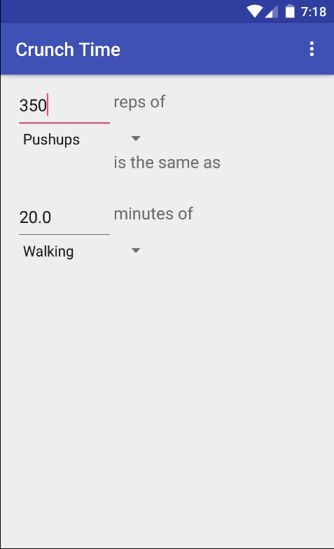

# PROG 01: Crunch Time

Crunch is a simple yet functional app that lets you the equivalent amount of different exercises in respect to the number of calories burned.

Simply use the menus to select the exercises you want to compare and then either the amount of one of the exercises and see the value in the other!

## Authors

Daniel Radding ([dradding@berkeley.edu](mailto:dradding@berkeley.edu))

## Demo Video

See [Daniel Radding Proj1 cs160](https://youtu.be/TVvo7ocGvB8)

## Screenshots

## [Github](https://github.com/cs160-sp16/prog-01-crunch-time-dradding)

## Acknowledgments

* Android/Java Docs
* Stackoverflow
